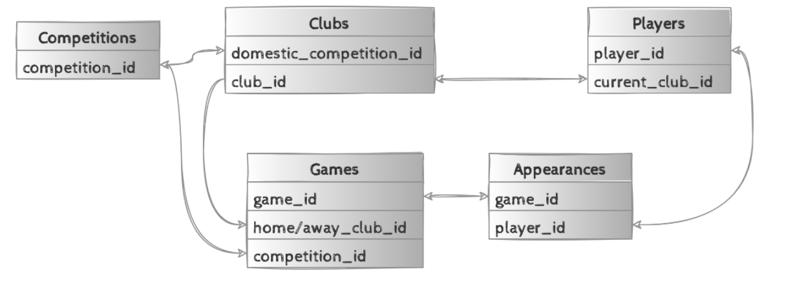

# Persistence layer
The persistence layer of the application is a MS SQL relational database. This database contains the tables with the football player data.

This module contains all files needed to build the docker image which contains the DB populated with all the data.

## Build the docker image
After making any changes build the Docker image

`docker build -t 29041993/players-sql-db .`

## Run the docker container
Run the container on localhost:1433

`docker run -e 'ACCEPT_EULA=Y' -e 'SA_PASSWORD=<password>' -e 'MSSQL_PID=Express' --name sqlserver -p 1433:1433 -d 29041993/players-sql-db:latest`

## Data source 
The data was extracted from [open source](https://data.world/dcereijo/player-scores) but originates from the popular Transfermarkt website. 

## DB schema

The below picture shows the DB schema of the different tables.

